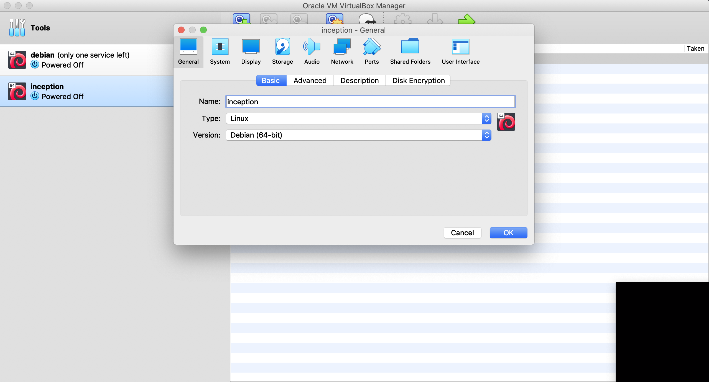
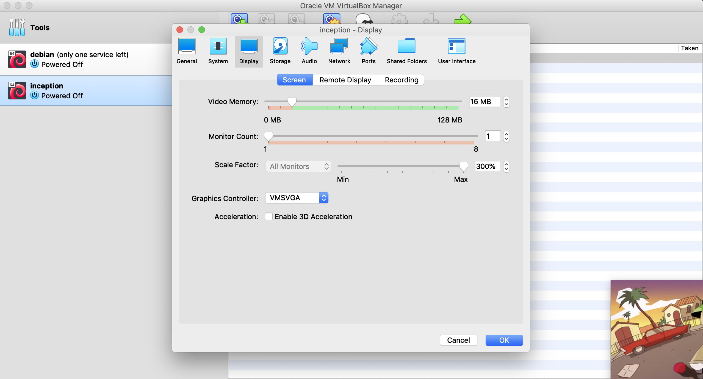
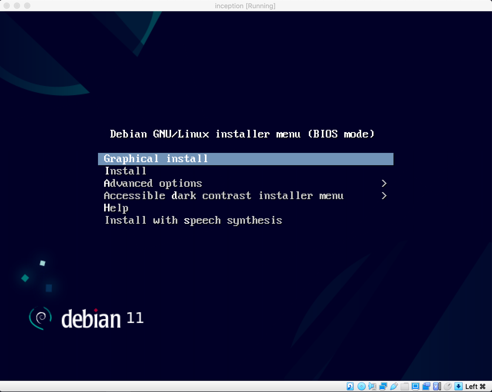
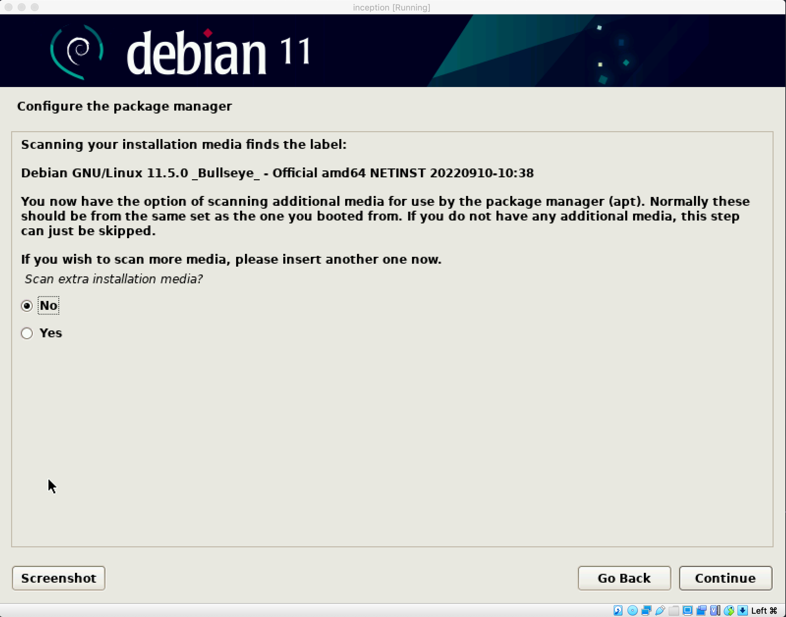

# INTRODUCTION

`INCEPTION` is a project that aims to broaden your knowledge of `system administration` by using `Docker`.
Instead of using already created images, we have to setup each service from scratch, and this `README` describes the process of setting it up

## 1. TOOLS AND SERVICES

### Docker

`Docker` is an open platform for developing, shipping, and running applications. It enables you to separate your `applications` from your `infrastructure` so you can deliver software quickly. With Docker, you can manage your infrastructure in the same ways you manage your applications.

Docker provides the ability to package and run an application in a loosely isolated environment called a `container`. The `isolation` and `security` allows you to run many containers simultaneously on a given host. Containers are lightweight and contain everything needed to run the application, so you do not need to rely on what is currently installed on the host. You can easily share containers while you work, and be sure that everyone you share with gets the same container that works in the same way.

> :bulb: short introduction to docker in [this video](https://www.youtube.com/watch?v=Gjnup-PuquQ&ab_channel=Fireship)

### Docker Compose

`Docker Compose` is a tool that was developed to help define and share `multi-container applications`. With Compose, we can create a YAML file to define the services and with a single command, can spin everything up or tear it all down.

### NGINX

### MariaDB

`MariaDB` is a community-developed, commercially supported fork of the `MySQL` relational database management system (RDBMS), intended to remain free and open-source software under the GNU General Public License.

MariaDB is intended to maintain high compatibility with MySQL, with library binary parity and exact matching with MySQL APIs and commands, allowing it in many cases to function as drop-in replacement for MySQL.

> :bulb: short introduction to SQL in [this video](https://www.youtube.com/watch?v=zsjvFFKOm3c&ab_channel=Fireship)

### WordPress

`WordPress` is a `content management system` (CMS) that allows you to host and build websites. WordPress contains `plugin architecture` and a `template system`, so you can customize any website to fit your business, blog, portfolio, or online store.

A `CMS` is a software application that allows you to create, edit, and publish content on a website without having to know how to code.

### Redis

`Redis` (Remote Dictionary Server) is an in-memory data structure store, used as a distributed, in-memory key–value database, cache and message broker, with optional durability. Redis supports different kinds of abstract data structures, such as strings, lists, maps, sets, sorted sets, HyperLogLogs, bitmaps, streams, and spatial indices.

> :bulb: short introduction to Redis in [this video](https://www.youtube.com/watch?v=G1rOthIU-uo&ab_channel=Fireship)

### FTP

`FTP` (File Transfer Protocol) is a network protocol for transmitting files between computers over `Transmission Control Protocol/Internet Protocol` (TCP/IP) connections. Within the TCP/IP suite, FTP is considered an `application layer` protocol.

In an FTP transaction, the end user's computer is typically called the `local host`. The second computer involved in FTP is a `remote host`, which is usually a server. Both computers need to be connected via a network and configured properly to transfer files via FTP. Servers must be set up to run `FTP services`, and the client must have `FTP software` installed to access these services.

### Adminer

`Adminer` is a database management tool that can be accessed via your web browser. It's a singular file written in PHP which can be deployed wherever you need it just by moving the file to wherever you need it to be and accessing it via your web browser. It's a great tool for managing your databases when you don't have access to a GUI like `phpMyAdmin`.

### Portainer (you can use other services, the choice is yours)

`Portainer` is a universal container management tool that can work with both Docker and Kubernetes to make the deployment and management of containerized applications and services easier and more efficient.

## 2. COMMANDS AND USAGE

### Docker

- `docker ps` : list all running containers
- `docker ps -a` : list all containers
- `docker images` : list all images
- `docker volume ls` : list all volumes
- `docker network ls` : list all networks
- `docker exec -it <container_name>/<ID> /bin/bash or /bin/sh` : access a container
- `docker run -p [host_port]:[container_port] --env [key]=[value] -it [image]:[tag]` : run a container with a specific port and environment variables and access it.
- `docker stop <container_name>/<ID>` : stop a container
- `docker rm <container_name>/<ID>` : remove a container
- `docker rm $(docker ps -aq)` : remove all containers
- `docker rmi <image_name>/<ID>` : remove an image
- `docker rmi $(docker images -q)` : remove all images
- `docker rmi $(docker  images --filter "dangling=true" -q)` : remove all dangling images (<none> images that are not used by any container)
- `docker volume rm $(docker volume ls -q)` : remove all volumes
- `docker network rm $(docker network ls -q)` : remove all networks
- `docker-compose up -d` : start all containers in background mode
- `docker-compose down` : stop all containers
- `docker-compose down --rmi all` : stop all containers and remove all images
- `docker system prune -a` : remove all unused containers, networks, images (both dangling and unreferenced), and optionally, volumes

> :bulb: docker run -p 3000:80 -p 3001:443 -p 3306:3306 --env USER=foo --env PASSWORD=bar -it debian:buster

**FLAGS**

- `-p` : port mapping (host_port:container_port)
- `--env` : set environment variables (key=value)
- `-it` : interactive mode (access the container)
- `-d` : detached mode (run containers in the background)
- `--rmi` : remove images (all)
- `-a` : all (containers, images, volumes, networks)
- `-q` : quiet mode (only display numeric IDs)

### MariaDB

**QUERIES**

- `CREATE DATABASE [database_name];` : create a database with the name [database_name]
- `CREATE USER '[username]'@'[hostname]' IDENTIFIED BY '[password]';` : create a user with the name [username] and password [password]
- `GRANT ALL PRIVILEGES ON [database_name].* TO '[username]'@'[hostname]';` : grant all privileges to the user [username] on the database [database_name]
- `DROP DATABASE [database_name];` : drop a database with the name [database_name]
- `DROP USER [username]@'[hostname]';` : drop a user with the name [username]
- `FLUSH PRIVILEGES;` : reload the privilege tables

- `mysql -u [user] -p[password] -e "[QUERY]"` : access the database with a specific user and password and execute a query

> :bulb: mysql -u user -pPASSWORD -e "CREATE DATABASE test;"

**FLAGS**

- `-u` : user
- `-p` : password
- `-e` : execute

## . ADDITIONAL TOOLS AND INFORMATIONS

### OpenRC

`OpenRC` is a system initialization framework that provides parallel startup of the various runlevels, starting and stopping of services and other system utilities in a sane and safe order.

**FLAGS:**

- `mkdir -p ...` : create a directory and all parent directories if needed
- `chown -R ...` : change the owner of a file or directory and all its subdirectories and files
- `chmod 777 ...`: give read, write, and execute permissions to all users, including the owner, group, and others

### MKCERT

`mkcert` is a simple tool for making locally-trusted development certificates. It requires no configuration.

### OpenSSL

`OpenSSL` is a software library for applications that secure communications over computer networks against eavesdropping or need to identify the party at the other end. It is widely used by Internet servers, including the majority of HTTPS websites.

> :bulb: you can use either openssl or mkcert to generate your certificates and keys for your SSL connection

### VSFTPD

`vsftpd` (Very Secure FTP Daemon) is a lightweight, stable and secure FTP server for UNIX-like systems.

> ## :warning: don't forget to add your environment variables to your .env file

> ## :warning: here is a [script](./setup_alpine.sh) to help you setup the whole project

---

# Virtual machine setup

Show/Hide

**Select New And Follow The Steps Below**

**Select Your Machine And Choose Settings**

**Now Start Your Machine And Select Your .img File**

> :bulb: you can use a `Desktop Environment (DE)` like below or you can remove it and install a lighter `DE` like this

    apt install -y openbox xinit kitty firefox-esr

> :bulb: you can access you `DE` with the command `startx` and use the right mouse button to use your `software` or exit to the `tty`

**Now Boot Into Your Machine and Install Your Softwares**

then switch to root using the cmd

    su -

afterward, update and upgrade your system

    apt update -y && apt upgrade -y

these are the packages that we will need

    apt install -y sudo ufw docker docker-compose make wget curl libnss3-tools git filezilla

### setup ssh

    sed -i "s|#Port 22|Port 42|g" /etc/ssh/sshd_config
    sed -i "s|#PermitRootLogin prohibit-password|PermitRootLogin yes|g" /etc/ssh/sshd_config
    sed -i "s|#PubkeyAuthentication yes|PubkeyAuthentication no|g" /etc/ssh/sshd_config
    sed -i "s|#PasswordAuthentication yes|PasswordAuthentication yes|g" /etc/ssh/sshd_config

### setup ufw

    ufw enable
    ufw allow 3000
    ufw allow 8080
    ufw allow 443
    ufw allow 21
    ufw allow 42
    ufw allow 9443

now you can reboot your machine and connect using ssh from the host

    ssh [root/user]@localhost -p 42

### setup sudo

    nano /etc/sudoers

add your user below root like this

now change from root to your user

    su [user]
    cd ~

**Add User To Docker Group**

    sudo usermod -aG docker [user]
    service docker restart

> :warning: Don't forget to add your `domain name` your host file `/etc/hosts` (eg. [intra-name].42.fr)

> :warning: Don't forget to install either `mkcert` or `openssl` if you want generate your certificate outside of the Dockerfile

---

# NGINX

Show/Hide

    docker run -p 443:443 -it alpine:3.17

### 1. update the package list

**debian:stable**

    apt update -y && apt upgrade -y

**alpine:3.17**

    apk update && apk upgrade

### 2. Install NGINX and OpenSSL

**debian:stable**

    apt install -y nginx openssl

**alpine:3.17**

    apk add nginx openssl --no-cache

**extra**

    mkdir -p /etc/nginx/ssl

### 3. Create a self-signed certificate

    openssl req -x509 -new -newkey rsa:2048 -nodes -keyout /etc/nginx/ssl/[anything].key -out /etc/nginx/ssl/[anything].crt -subj "/C=[XX]/ST=[XXXXXXXXX]/L=[XXXXX]/O=[XXXXXXXXXX]/OU=[XXX]/CN=[XXXXX]"

**FLAGS**

- `req`: creates and processes certificate requests
- `-x509`: generate a self-signed certificate
- `-new`: create a new certificate request
- `-newkey rsa:2048`: create a new private key using RSA and 2048 bit
- `-nodes`: no passphrase/password (not encrypted)
- `-keyout`: output the private key to a file
- `-out`: generate the certificate to a file (_.crt / _.csr)
- `-subj`: provide the certificate information
  - `/C`: Country Name (2 letter code eg. US)
  - `/ST`: State or Province Name (full name)
  - `/L`: Locality Name (eg, city)
  - `/O`: Organization Name (eg, company)
  - `/OU`: Organizational Unit Name (eg, section)
  - `/CN`: Common Name (eg, your name or your server's hostname)

> :bulb: for more detailed information about the `openssl req` command, check [this](https://www.openssl.org/docs/man1.1.1/man1/openssl-req.html)

> :bulb: if you already have the certificate you won't need openssl you can just link their location through volumes in the docker-compose.yml file

### 4. Create a new NGINX configuration file

    vim /etc/nginx/nginx.conf

- :arrow_right: [here](./extra/nginx.conf)

> :bulb: don't forget to replace the certificate name and key in the config file with the one you choose in the openssl cmd
> :bulb: you can skip this step and just link the configuration file through volumes in the docker-compose.yml file

> **:warning: check if the configuration file is valid by running `nginx -t`**

### 5. Create the files you want to serve

    vim [path]/index.html

- :arrow_right: [here](./extra/index.html)

> **:warning: the path is the same as the one you specified in the NGINX configuration file as root/location**

### 6. Start the NGINX service

**debian:stable**

    service nginx start

**alpine:3.17**

    nginx

### 7. Test the service

from your host machine, open your browser and go to `https://localhost:[host_port]`

### 8. Additional Tips

**check if nginx compatible with TSLv1.2 and TLSv1.3**

- for TSLv1.1 `should fail`

      curl -I -v --tlsv1.1 --tls-max 1.1 https://localhost:[host_port] -k

- for TSLv1.2 `should pass if you have TLSv1.2 enabled`

      curl -I -v --tlsv1.2 --tls-max 1.2 https://localhost:[host_port] -k

- for TSLv1.3 `should pass if you have TLSv1.3 enabled`

      curl -I -v --tlsv1.3 --tls-max 1.3 https://localhost:[host_port] -k

> :bulb: if you get `The plain HTTP request was sent to HTTPS port` try sending request to https instead of http

### 9. Dockerfile

**debian:stable**

    FROM debian:stable

    RUN apt update -y && apt upgrade -y

    RUN apt install -y nginx openssl

    RUN openssl req -x509 -new -newkey rsa:2048 -nodes -keyout /etc/ssl/private/[anything].key -out /etc/ssl/private/[anything].crt -subj "/C=[XX]/ST=[XXXXXXXXX]/L=[XXXXX]/O=[XXXXXXXXXX]/OU=[XXX]/CN=[XXXXX]"

    COPY ./conf/nginx.conf:/etc/nginx/sites-available/default

    EXPOSE 443

    CMD ["nginx", "-g", "daemon off;"]

**alpine:3.17**

    FROM alpine:3.17

    RUN apk update && apk upgrade

    RUN apk add nginx openssl --no-cache

    RUN openssl req -x509 -new -newkey rsa:2048 -nodes -keyout /etc/ssl/private/[anything].key -out /etc/ssl/private/[anything].crt -subj "/C=[XX]/ST=[XXXXXXXXX]/L=[XXXXX]/O=[XXXXXXXXXX]/OU=[XXX]/CN=[XXXXX]"

    # we copy the local configuration file to the container nginx folder
    COPY ./conf/* /etc/nginx/http.d/

    EXPOSE 443

    CMD ["nginx", "-g", "daemon off;"]

**configuration file for wordpress**

    server {
    	listen 443 ssl;

    	server_name [DOMAIN_NAME] www.[DOMAIN_NAME];

    	ssl_certificate /etc/ssl/private/[CERTIFICATE].crt;
    	ssl_certificate_key /etc/ssl/private/[CERTIFICATE].key;

    	ssl_protocols TLSv1.2 TLSv1.3;

    	root /var/www/;

    	index index.php index.html;

    	location / {
    		try_files $uri /index.php?$args;
    		add_header Last-Modified $date_gmt;
    		add_header Cache-Control 'no-store, no-cache';
    		if_modified_since off;
    		expires off;
    		etag off;
    	}

    	location ~ \.php$ {
    		fastcgi_split_path_info ^(.+\.php)(/.+)$;
    		fastcgi_pass wordpress:9000;
    		fastcgi_index index.php;
    		include fastcgi_params;
    		fastcgi_param SCRIPT_FILENAME $document_root$fastcgi_script_name;
    		fastcgi_param PATH_INFO $fastcgi_path_info;
    	}
    }

---

# MariaDB

Show/Hide

    docker run -p 3306:3306 -it alpine:3.17

### 1. update the package list

**debian:stable**

    apt update -y && apt upgrade -y

**alpine:3.17**

    apk update && apk upgrade

### 2. Install MariaDB , MariaDB-client and OpenRC (for alpine)

> :bulb: since alpine can't run `service` command, we need to install `OpenRC` to be able to run `rc-service`

**debian:stable**

    apt install -y mariadb-server mariadb-client

**alpine:3.17**

    apk add mariadb mariadb-client openrc

> :warning: since your system didn't boot with OpenRC, you will get an error when you try to start any service, to fix this, you need to run `openrc` and then `touch /run/openrc/softlevel`

    openrc && touch /run/openrc/softlevel

### 3. Create the directory where the `socket` file will be stored

    mkdir -p /var/run/mysqld

### 4. Change the owner of the directory to `mysql`

    chown -R mysql:mysql /var/run/mysqld

### 5. Change the permissions of the directory to avoid any complications

    chmod 777 /var/run/mysqld

### 6. Change in the configuration file

**debian:stable**

    sed -i "s|bind-address            = 127.0.0.1|bind-address            = 0.0.0.0|g" /etc/mysql/mariadb.conf.d/50-server.cnf

**alpine:3.17** `enable remote access`

    sed -i "s|skip-networking|skip-networking=0|g" /etc/my.cnf.d/mariadb-server.cnf

### 7. Create a config file for mysqld

    {
    	echo "[mysqld]";
    	echo "skip-host-cache";
    	echo "skip-name-resolve";
    	echo "bind-address=0.0.0.0";
    } > /etc/my.cnf.d/docker.cnf

### 8. Run the `mysql_install_db` command to create the database

**debian:stable**

    mysql_install_db

**alpine:3.17**

    mysql_install_db --user=mysql --datadir=/var/lib/mysql

> :bulb: --user is the user that will own the database files and --datadir is the directory where the database files will be stored

### 9. Start the MariaDB service

**debian:stable**

    service mariadb start

**alpine:3.17**

    rc-service mariadb start

### 10. Secure the installation

> :bulb: you can use the `mysql_secure_installation` command to secure the installation, but it will ask you for a password, so you can use the following commands instead

**debian:stable**

    # Remove the test database
    mysql -u root -e "DROP DATABASE IF EXISTS test;"

    # Create a Database and a user for remote access
    mysql -u root -e "CREATE DATABASE IF NOT EXISTS $MYSQL_DATABASE; GRANT ALL ON $MYSQL_DATABASE.* TO '$MYSQL_USER'@'%' IDENTIFIED BY '$MYSQL_PASSWORD';"

    # Change the root password
    mysql -u root -e "ALTER USER 'root'@'localhost' IDENTIFIED BY '${MYSQL_ROOT_PASSWORD}';"

    # Reload privileges
    mysql -u root -e "FLUSH PRIVILEGES;"

**alpine:3.17**

    # Remove the test database
    mysql -u root -e "DROP DATABASE IF EXISTS test;"

    # Remove anonymous users for localhost and other hosts
    mysql -u root -e "DROP USER ''@'localhost';"
    mysql -u root -e "DROP USER ''@'$(hostname)';"

    # Create a Database and a user for remote access
    mysql -u root -e "CREATE DATABASE IF NOT EXISTS $MYSQL_DATABASE; GRANT ALL ON $MYSQL_DATABASE.* TO '$MYSQL_USER'@'%' IDENTIFIED BY '$MYSQL_PASSWORD';"

    # Change the root password
    mysql -u root -e "ALTER USER 'root'@'localhost' IDENTIFIED BY '${MYSQL_ROOT_PASSWORD}';"

    # Reload privileges
    mysql -u root -e "FLUSH PRIVILEGES;"

> :bulb: **use of environment variables is recommended**

> :bulb: for more information about the `mysql_secure_installation` command, you can check the [official documentation](https://mariadb.com/kb/en/mysql_secure_installation/)

> :bulb: for more information about automating `mysql_secure_installation`, you can check [this article](https://fedingo.com/how-to-automate-mysql_secure_installation-script/)

### 11. Stop the MariaDB service

**debian:stable**

    mysqladmin shutdown -p${MYSQL_ROOT_PASSWORD}

> sometimes `service mariadb stop` command might fail so we'll use `mysqladmin` instead

**alpine:3.17**

    rc-service mariadb stop

### 12. Run the `mysqld` command to start the service

    mysqld --user=mysql

### 13. Connect to the database from the host machine

    mysql -h 127.0.0.1 -P [HOST_PORT] -u [DB_USER/root] -p[USER_PASSWORD/ROOT_PASSWORD]
    # or
    docker exec -it [CONTAINER_ID] mysql -u [DB_USER/root] -p[USER_PASSWORD/ROOT_PASSWORD]

### 14. Dockerfile

**debian:stable**

    FROM debian:stable

    RUN apt update -y && apt upgrade -y

    RUN apt install -y mariadb-server mariadb-client

    RUN mkdir -p /var/run/mysqld
    RUN chown -R mysql /var/run/mysqld
    RUN chmod -R 777 /var/run/mysqld

    RUN sed -i "s|bind-address            = 127.0.0.1|bind-address            = 0.0.0.0|g" /etc/mysql/mariadb.conf.d/
    50-server.cnf

    COPY ./tools/script.sh .

    RUN chmod +x script.sh

    CMD ["sh", "script.sh"]

**alpine:3.17**

    FROM alpine:3.17

    RUN apk update && apk upgrade

    RUN apk add mariadb mariadb-client openrc --no-cache

    RUN openrc && touch /run/openrc/softlevel

    RUN mkdir -p /var/run/mysqld
    RUN chown -R mysql:mysql /var/run/mysqld
    RUN chmod 777 /var/run/mysqld

    RUN sed -i "s|skip-networking|skip-networking=0|g" /etc/my.cnf.d/mariadb-server.cnf

    RUN {
    	echo "[mysqld]";
    	echo "skip-host-cache";
    	echo "skip-name-resolve";
    	echo "bind-address=0.0.0.0";
    } > /etc/my.cnf.d/docker.cnf

    COPY ./tools/script.sh .

    RUN chmod +x script.sh

    CMD ["./script.sh"]

**script**

- **debian:stable**

      #!/bin/sh

      mysql_install_db

      service mariadb start

      if [ ! -d "/var/lib/mysql/$MYSQL_DATABASE" ]
      then
      	mysql -u root -e "DROP DATABASE IF EXISTS test;"
      	mysql -u root -e "CREATE DATABASE IF NOT EXISTS $MYSQL_DATABASE; GRANT ALL ON $MYSQL_DATABASE.* TO 	'$MYSQL_USER'@'%' IDENTIFIED BY '$MYSQL_PASSWORD';"
      	mysql -u root -e "ALTER USER 'root'@'localhost' IDENTIFIED BY '${MYSQL_ROOT_PASSWORD}';"
      	mysql -u root -e "FLUSH PRIVILEGES;"
      fi

      mysqladmin shutdown -p${MYSQL_ROOT_PASSWORD}

      exec mysqld --user=mysql

- **alpine:3.17**

      #!/bin/sh

      mysql_install_db --user=mysql --datadir=/var/lib/mysql

      rc-service mariadb start

      if [ ! -d "/var/lib/mysql/$MYSQL_DATABASE" ]
      then
      	mysql -u root -e "DROP DATABASE IF EXISTS test;"
      	mysql -u root -e "DROP USER ''@'localhost';"
      	mysql -u root -e "DROP USER ''@'$(hostname)';"
      	mysql -u root -e "CREATE DATABASE IF NOT EXISTS $MYSQL_DATABASE; GRANT ALL ON $MYSQL_DATABASE.* TO '$MYSQL_USER'@'%' IDENTIFIED BY '$MYSQL_PASSWORD';"
      	mysql -u root -e "ALTER USER 'root'@'localhost' IDENTIFIED BY '${MYSQL_ROOT_PASSWORD}';"
      	mysql -u root -e "FLUSH PRIVILEGES;"
      fi

      rc-service mariadb stop

      exec mysqld --user=mysql

> :bulb: since everything else is linked we are going to directly create Dockerfile instead of step by step guide

---

# WordPress

Show/Hide

### 1. Create a `Dockerfile`

**debian:stable**

    FROM debian:stable

    ARG MYSQL_DATABASE MYSQL_USER MYSQL_PASSWORD VERSION=7.4

    WORKDIR /var/www

    RUN apt update -y && apt upgrade -y

    RUN apt install -y php${VERSION} php${VERSION}-fpm php${VERSION}-mysqli php${VERSION}-json php${VERSION}-curl php$
    {VERSION}-dom php${VERSION}-exif php${VERSION}-fileinfo php${VERSION}-mbstring php${VERSION}-xml php${VERSION}-zip
    wget unzip

    RUN sed -i "s|listen = /run/php/php${VERSION}-fpm.sock|listen = 9000|g" /etc/php/${VERSION}/fpm/pool.d/www.conf

    RUN wget https://wordpress.org/latest.zip && unzip latest.zip && cp -rf wordpress/* . && rm -rf wordpress latest.
    zip && rm -rf wp-config-sample.php && chmod -R 777 wp-content

    RUN mkdir -p /run/php/

    COPY ./tools/script.sh .

    RUN chmod +x script.sh && ./script.sh

    CMD ["/usr/sbin/php-fpm7.4", "-F"]

**alpine:3.17**

    FROM alpine:3.17

    ARG MYSQL_DATABASE MYSQL_USER MYSQL_PASSWORD

    WORKDIR /var/www

    RUN apk update && apk upgrade

    RUN apk update && apk upgrade && apk add --no-cache php php-fpm php-mysqli php-json php-curl php-dom php-exif 	php-fileinfo php-mbstring php-openssl php-xml php-zip wget unzip

    RUN sed -i "s|listen = 127.0.0.1:9000|listen = 9000|g" /etc/php81/php-fpm.d/www.conf

    RUN wget https://wordpress.org/latest.zip && unzip latest.zip && cp -rf wordpress/* . && rm -rf wordpress latest.	zip && rm -rf wp-config-sample.php && chmod -R 777 wp-content

    COPY ./tools/script.sh .

    RUN chmod +x script.sh && ./script.sh

    CMD ["/usr/sbin/php-fpm81", "-F"]

> :bulb: since we need environment variables to connect to the database, we will use the `ARG` instruction to pass the variables to the build process

> :bulb: in case you are wondering why are we installing all these php extensions, we can actually set it up with only the `php`, `php-fpm` and `php-mysqli` extension, however, to avoid any issues, we will install all the extensions that are required by wordpress check [this article](https://make.wordpress.org/hosting/handbook/server-environment/) for more information

> :bulb: we will use the `sed` command to change the `listen` directive in the `www.conf` file, to listen to all the interfaces instead of only the localhost

> :bulb: we will use the `wget` command to download the latest version of wordpress, and the `unzip` command to extract the files, then we will copy the files to the current directory, and remove the downloaded files

> :bulb: we will remove the `wp-config-sample.php` file (or you can simply change the configuration inside it and rename it to wp-config.php), and set the permissions of the `wp-content` directory to `777` to avoid any issues

> :bulb: we will copy the `script.sh` file to the current directory, and run it

> :bulb: we will use the `CMD` instruction to run the `php-fpm` command

**script**

    #!/bin/sh
    cat << EOF > /var/www/wp-config.php
    <?php
    define( 'DB_NAME', '$MYSQL_DATABASE' );
    define( 'DB_USER', '$MYSQL_USER' );
    define( 'DB_PASSWORD', '$MYSQL_PASSWORD' );
    define( 'DB_HOST', 'mariadb' );
    define( 'DB_CHARSET', 'utf8' );
    define( 'DB_COLLATE', '' );
    define('FS_METHOD','direct');
    \$table_prefix = 'wp_';
    define( 'WP_DEBUG', false );
    define( 'WP_REDIS_HOST', 'redis' );
    define( 'WP_REDIS_PORT', 6379 );
    define( 'WP_CACHE', true )
    if ( ! defined( 'ABSPATH' ) ) {
    define( 'ABSPATH', __DIR__ . '/' );}
    require_once ABSPATH . 'wp-settings.php';
    EOF

> :bulb: we will use the `cat` command to create the `wp-config.php` file, and set the database name, user, password, and host, we also define `redis host`, `port` and we enable `cache`,we will keep the rest of the configuration as it is (you can check the wp-config-sample.php file to see the default configurations)

---

# Redis

Show/Hide

### 1. Create a `Dockerfile`

**debian:stable**

    FROM debian:stable

    RUN apt update -y && apt upgrade -y

    RUN apt install -y redis

    RUN sed -i "s|bind 127.0.0.1 ::1|#bind 127.0.0.1 ::1|g" /etc/redis/redis.conf

    RUN sed -i "s|# maxmemory <bytes>|maxmemory 100mb|g" /etc/redis/redis.conf

    RUN sed -i "s|# maxmemory-policy noeviction|maxmemory-policy allkeys-lru|g" /etc/redis/redis.conf

    CMD ["redis-server", "--protected-mode no"]

**alpine:3.17**

    FROM alpine:3.17

    RUN apk update && apk upgrade

    RUN apk add --no-cache redis

    RUN sed -i "s|bind 127.0.0.1 -::1|#bind 127.0.0.1 -::1|g" /etc/redis.conf

    RUN sed -i "s|# maxmemory <bytes>|maxmemory 100mb|g" /etc/redis.conf

    RUN sed -i "s|# maxmemory-policy noeviction|maxmemory-policy allkeys-lru|g" /etc/redis.conf

    CMD ["redis-server", "/etc/redis.conf", "--protected-mode no"]

> :bulb: we will use the `sed` command to change the `bind` directive in the `redis.conf` file, to listen to all the interfaces instead of only the localhost

> :bulb: we will use the `sed` command to change the `maxmemory` directive in the `redis.conf` file, to set the maximum memory to 100mb

> :bulb: we will use the `sed` command to change the `maxmemory-policy` directive in the `redis.conf` file, to set the maximum memory policy to `allkeys-lru`

> :bulb: we will use the `CMD` instruction to run the `redis-server` command

> :bulb: after you finish got to wordpress and install the [Redis Object Cache](https://wordpress.org/plugins/redis-cache/) plugin

> :bulb: you can check the [redis.conf](./extra/redis.conf) file to see the default configurations and an explanation for each configuration

### 2. Check if redis is working

    docker exec -it redis redis-cli

> :bulb: you should see the redis prompt `127.0.0.1:6379>`, type `ping` and you should see `PONG` as a response if everything is working correctly.

    docker exec -it redis redis-cli monitor

> :bulb: if everything is working correctly, you should see the `OK` message. and any activity in your `wordpress website` should send some logs

---

# FTP

Show/Hide

### 1. Create a `Dockerfile`

**debian:stable**

    FROM debian:stable

    RUN apt update -y && apt upgrade -y

    RUN apt install -y vsftpd

    COPY ./conf/vsftpd.conf /etc/vsftpd.conf

    COPY ./tools/script.sh .

    RUN chmod +x script.sh

    EXPOSE 21

    CMD ["./script.sh"]

**alpine:3.17**

    FROM alpine:3.17

    RUN apk update && apk upgrade

    RUN apk add --no-cache vsftpd

    COPY ./conf/vsftpd.conf /etc/vsftpd/vsftpd.conf

    COPY ./tools/script.sh .

    RUN chmod +x script.sh

    EXPOSE 21

    CMD ["./script.sh"]

**script**

- **debian:stable**

      mkdir -p /var/run/vsftpd/empty

      adduser --home /var/www ${FTP_USER}

      echo ${FTP_USER}:${FTP_PASSWORD} | chpasswd

      adduser ${FTP_USER} root

      exec /usr/sbin/vsftpd /etc/vsftpd.conf

- **alpine:3.17**

      #!/bin/sh

      adduser -h /var/www -D ${FTP_USER}

      echo ${FTP_USER}:${FTP_PASSWORD} | chpasswd

      adduser ${FTP_USER} root

      exec /usr/sbin/vsftpd /etc/vsftpd/vsftpd.conf

> :bulb: we will use the `adduser` command to create a new user, and set the home directory to `/var/www` , and we will set the password using the `chpasswd` command

> :bulb: the option `-D` will create a system user with default values, and the option `-h` will set the home directory for the user (if the home directory doesn't exist, it will be created automatically, and the owner will be set to the user)

> :bulb: we will use the `adduser` command to add the user to the `root` group

> :bulb: we will use the `exec` command to run the `vsftpd` command

**configuration**

uncomment the following lines in the `vsftpd.conf` file

    line 15: #local_enable=YES => local_enable=YES
    line 18: #write_enable=YES => write_enable=YES
    line 98: #chroot_local_user=YES => chroot_local_user=YES

and add the following lines

    allow_writeable_chroot=YES
    seccomp_sandbox=NO
    pasv_enable=YES

> :bulb: we will use the `allow_writeable_chroot` directive to allow the user to write to the home directory (this is not recommended, but it's ok for testing)

> :bulb: we will use the `seccomp_sandbox` directive to disable the seccomp sandbox, for more information check [this](https://en.wikipedia.org/wiki/Seccomp)

> :bulb: we will use the `pasv_enable` directive to enable the passive mode, for more information on passive method check [this article](https://www.lifewire.com/definition-of-passive-mode-ftp-816441)

> :bulb: you can check [this document](https://man.linuxreviews.org/man5/vsftpd.conf.5.html) to see all the configurations and an explanation for each of them

> :bulb: you can check the [vsftpd.conf](./extra/vsftpd.conf) file to see the default configurations and an explanation for each configuration

---

# Adminer

Show/Hide

### 1. Create a `Dockerfile`

**debian:stable**

    FROM debian:stable

    RUN apt update -y && apt upgrade -y

    RUN apt install -y php php-common php-iconv php-json php-gd php-curl php-xml php-mysqli php-imap php-cgi php-pdo
    php-soap php-posix php-ldap php-ctype php-dom php-simplexml wget

    WORKDIR /var/www

    RUN wget https://github.com/vrana/adminer/releases/download/v4.8.1/adminer-4.8.1.php

    RUN mv adminer-4.8.1.php index.php

    EXPOSE 8080

    CMD [ "php", "-S", "[::]:8080" , "-t", "/var/www" ]

**alpine:3.17**

    FROM alpine:3.17

    RUN apk update && apk upgrade

    RUN apk add --no-cache php php-common php-session php-iconv php-json php-gd php-curl php-xml php-mysqli php-imap php-cgi fcgi php-pdo php-pdo_mysql php-soap php-posix php-gettext php-ldap php-ctype php-dom php-simplexml wget

    WORKDIR /var/www

    RUN wget https://github.com/vrana/adminer/releases/download/v4.8.1/adminer-4.8.1.php

    RUN mv adminer-4.8.1.php index.php

    EXPOSE 8080

    CMD [ "php", "-S", "[::]:8080", "-t", "/var/www" ]

> :bulb: if you are wondering about all the php packages, since adminer can be used as a replacement for phpmyadmin, we will install all the php packages that are required for phpmyadmin check, [this](https://wiki.alpinelinux.org/wiki/PhpMyAdmin)

> :bulb: the option `-S` will start the php server and listen to the specified address and port, the option `-t` will set the document root for the php server to the specified directory, for more information check [this](https://www.php.net/manual/en/features.commandline.options.php)

---

# WebSite

Show/Hide

### 1. Create a `Dockerfile`

**debian:stable**

    FROM debian:stable

    RUN apt update -y && apt upgrade -y

    RUN apt install -y nginx

    COPY ./conf/nginx.conf /etc/nginx/nginx.conf

    COPY ./tools/* /var/www/

    EXPOSE 3000

    CMD [ "nginx", "-g", "daemon off;" ]

**alpine:3.17**

    FROM alpine:3.17

    RUN apk update && apk upgrade

    RUN apk add --no-cache nginx

    COPY ./conf/nginx.conf /etc/nginx/nginx.conf

    COPY ./tools/* /var/www/

    EXPOSE 3000

    CMD [ "nginx", "-g", "daemon off;" ]

**configuration**

    events {}

    http {

    	server {

    		listen 3000;
    		listen [::]:3000;

    		server_name server;

    		root /var/www/;
    		index index.html;

    		location / {
    				root /var/www/;
    				index index.html;
    		}
    	}
    }

> :bulb: put your website files in the `./tools` directory

---

# Portainer

Show/Hide

### 1. docker-compose.yml

**debian:stable**

    FROM debian:stable

    RUN apt update -y && apt upgrade -y

    RUN apt install -y curl tar

    RUN mkdir -p /var/lib/portainer

    RUN adduser --home /var/lib/portainer portainer

    RUN curl -sSL https://github.com/portainer/portainer/releases/download/2.16.2/portainer-2.16.2-linux-amd64.tar.gz |
    tar -xzo -C /usr/local

    CMD ["/usr/local/portainer/portainer"]

**alpine:3.17**

    FROM alpine:3.17

    RUN apk update && apk upgrade

    RUN apk add curl tar

    RUN mkdir -p /var/lib/portainer

    RUN adduser -h /var/lib/portainer -D portainer

    RUN curl -sSL https://github.com/portainer/portainer/releases/download/2.16.2/portainer-2.16.2-linux-amd64.tar.gz | tar -xzo -C /usr/local

    CMD ["/usr/local/portainer/portainer"]

> :bulb: you can now access portainer from `127.0.0.1:9443`

> :warning: the request should be sent over `https` not `http`

---

# Docker Compose and Makefile

Show/Hide

### 1. docker-compose.yml

    version: '3'

    services:
      nginx:
        build:
          context: ./requirements/nginx
          dockerfile: Dockerfile
        image: nginx
        container_name: nginx
        depends_on:
          - wordpress
        ports:
          - "443:443"
        networks:
          - inception
        volumes:
          - ./requirements/nginx/conf/:/etc/nginx/http.d/ # for alpine
            - ./requirements/nginx/conf/nginx.conf:/etc/nginx/sites-available/default # for debian
          - ./requirements/tools:/etc/nginx/ssl/
          - wp-data:/var/www/
        restart: always

      mariadb:
        build:
          context: ./requirements/mariadb
          dockerfile: Dockerfile
        image: mariadb
        container_name: mariadb
        volumes:
          - db-data:/var/lib/mysql
        environment:
          MYSQL_DATABASE: ${MYSQL_DATABASE}
          MYSQL_ROOT_PASSWORD: ${MYSQL_ROOT_PASSWORD}
          MYSQL_USER: ${MYSQL_USER}
          MYSQL_PASSWORD: ${MYSQL_PASSWORD}
        networks:
          - inception
        restart: always

      wordpress:
        build:
          context: ./requirements/wordpress
          dockerfile: Dockerfile
          args:
            MYSQL_DATABASE: ${MYSQL_DATABASE}
            MYSQL_ROOT_PASSWORD: ${MYSQL_ROOT_PASSWORD}
            MYSQL_USER: ${MYSQL_USER}
            MYSQL_PASSWORD: ${MYSQL_PASSWORD}
        image: wordpress
        container_name: wordpress
        depends_on:
          - mariadb
        volumes:
          - wp-data:/var/www/
        networks:
          - inception
        restart: always

      redis:
        build:
          context: ./requirements/bonus/redis
          dockerfile: Dockerfile
        image: redis
        container_name: redis
        ports:
          - "6379:6379"
        volumes:
          - wp-data:/var/www/
        networks:
          - inception
        restart: always

      ftp:
        build:
          context: ./requirements/bonus/ftp
          dockerfile: Dockerfile
        image: ftp
        container_name: ftp
        environment:
          FTP_USER: ${FTP_USER}
          FTP_PASSWORD: ${FTP_PASSWORD}
        ports:
          - "21:21"
        volumes:
          - wp-data:/var/www/
        networks:
          - inception
        restart: always

      adminer:
        build:
          context: ./requirements/bonus/adminer
          dockerfile: Dockerfile
        image: adminer
        container_name: adminer
        depends_on:
          - mariadb
        ports:
          - "8080:8080"
        networks:
          - inception
        restart: always

      website:
        build:
          context: ./requirements/bonus/website
          dockerfile: Dockerfile
        image: website
        container_name: website
        ports:
          - "3000:3000"
        networks:
          - inception
        restart: always

      portainer:
        build:
          context: ./requirements/bonus/portainer
          dockerfile: Dockerfile
        image: portainer
        container_name: portainer
        ports:
          - "9443:9443"
        volumes:
          - "/var/run/docker.sock:/var/run/docker.sock:ro"
          - portainer-data:/data
        networks:
          - inception
        restart: always

    volumes:
      wp-data:
        driver_opts:
          o: bind
          type: none
          device: /home/${USER}/data/wordpress

      db-data:
        driver_opts:
          o: bind
          type: none
          device: /home/${USER}/data/mariadb

      portainer-data:
        driver_opts:
          o: bind
          type: none
          device: /home/${USER}/data/portainer

    networks:
      inception:
        driver: bridge

**explaination**

- `version` : the version of the docker-compose file
- `sevices` : all the containers you need to run
  - `[service_name]`: the name of the service
    - `build` : all files , directories and instructions needed to build the image
      - `context` : the directory that contains the Dockerfile
      - `dockerfile` : the name of the Dockerfile
      - `args` : the arguments that will be passed to the Dockerfile
    - `image` : the name of the image (if no build is specified, the image will be pulled from docker hub)
    - `container_name` : the name of the container
    - `depends_on` : the services that this service depends on (the container will start after the depended services are up)
    - `ports` : the ports that will be exposed to the host
    - `networks` : the networks that the container will be connected to
    - `volumes` : the volumes that will be mounted to the container (file or directory can be shared between the host and the container)
    - `restart` : the restart policy
    - `environment` : the environment variables
- `volumes` : the volumes that will be created
  - `[volume_name]` : the name of the volume
    - `driver_opts` : the options of the volume
      - `o` : the type of the volume
      - `type` : the type of the volume
      - `device` : the path of the volume

### 2. Makefile

    NAME = inception

    all:
    	sh ./srcs/requirements/tools/script.sh # create the volume folders
    	docker-compose -f ./srcs/docker-compose.yml --env-file ./srcs/.env up -d

    build:
    	sh ./srcs/requirements/tools/script.sh
    	docker-compose -f ./srcs/docker-compose.yml --env-file ./srcs/.env up -d --build

    start:
    	docker-compose -f ./srcs/docker-compose.yml --env-file ./srcs/.env start

    stop:
    	docker-compose -f ./srcs/docker-compose.yml --env-file ./srcs/.env stop

    down:
    	docker-compose -f ./srcs/docker-compose.yml --env-file ./srcs/.env down

    re: down
    	docker-compose -f ./srcs/docker-compose.yml --env-file ./srcs/.env up -d --build

    clean: down
    	docker system prune -a
    	sudo rm -rf ~/data

    fclean:
    	docker stop $$(docker ps -aq)
    	docker system prune --all --force --volumes
    	docker network prune --force
    	docker volume prune --force
    	sudo rm -rf ~/data

